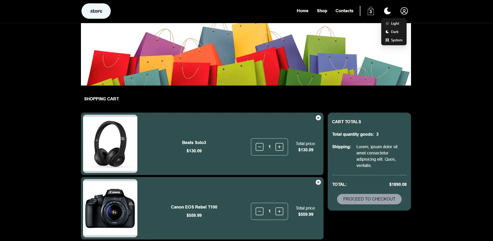

## Getting Started with Create React App

In the project directory, you can run:

### `npm start`

Runs the app in the development mode.
Open [http://localhost:3000](http://localhost:3000) to view it in your browser.

directory - /server

### `npm start`

Goods Store React App
This project [Demo](https://konstvb-rep.github.io/goods_store/).

## Available Scripts

Used API: [Fake Store API](https://fakestoreapiserver.reactbd.com/walmart).

Used by the library:

- react-router-dom;
- framer-motion;
- redux-persist;
- react-toastify;
- firebase;
- axios;
- antd;
- react-stripe-checkout;
- react-icons;
- @reduxjs/toolkit;
- tailwindcss;

